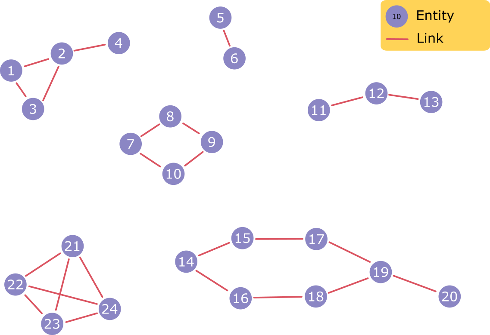
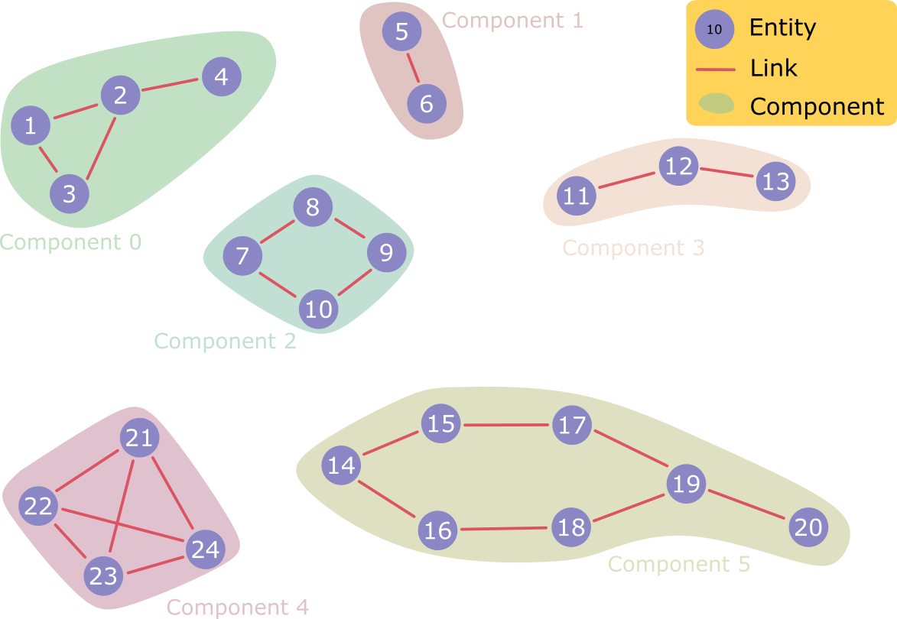

# Connected Component Calculator

## Introduction

This Golang project reads a CSV file of edges of a graph and calculates the connected component to which each vertex belongs.

For example, given the graph shown:



the connected components are as labelled:



The code takes an input CSV file of edge lists, e.g.

```
1,2
2,3
4,5
```

and produces a CSV file with a specified delimiter, e.g.

```
Entity ID,Component ID
1,0
2,0
3,0
4,1
5,1
```

## Usage

- Build the executable with `go build`

- To get help on using the program: `./connected-component.exe -h`

- Run the executable: `./connected-component.exe -input <input file> -output <output file> -delimiter <delimiter>`

- To see a demo: `./connected-component.exe -input ./demo/edges.csv -output ./demo/results.csv -delimiter ,`
